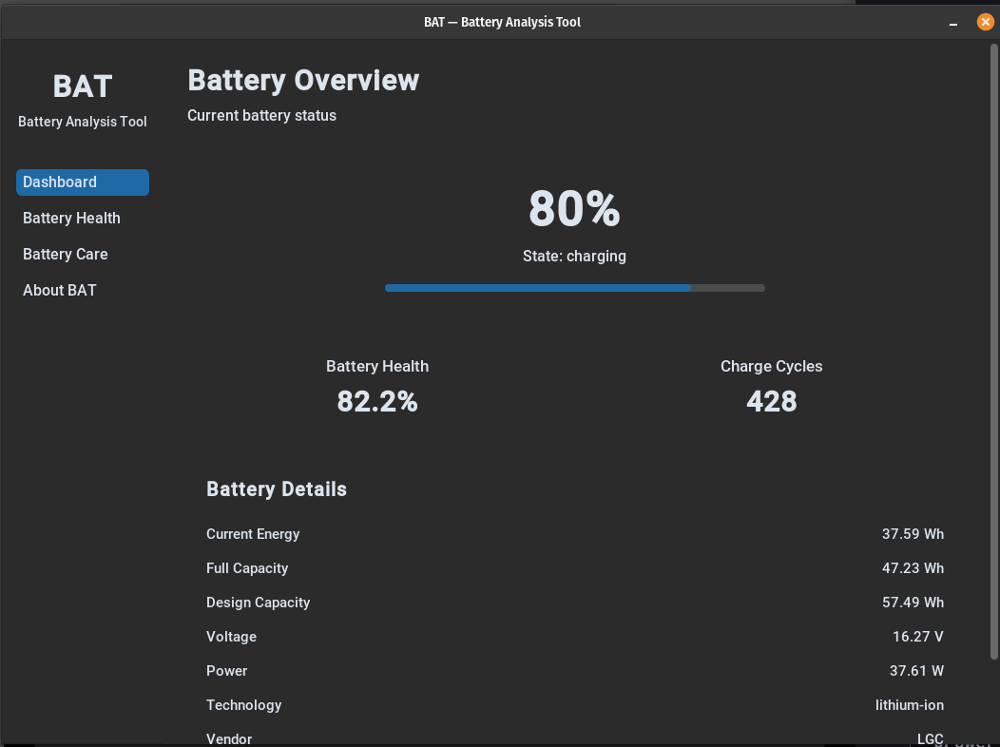
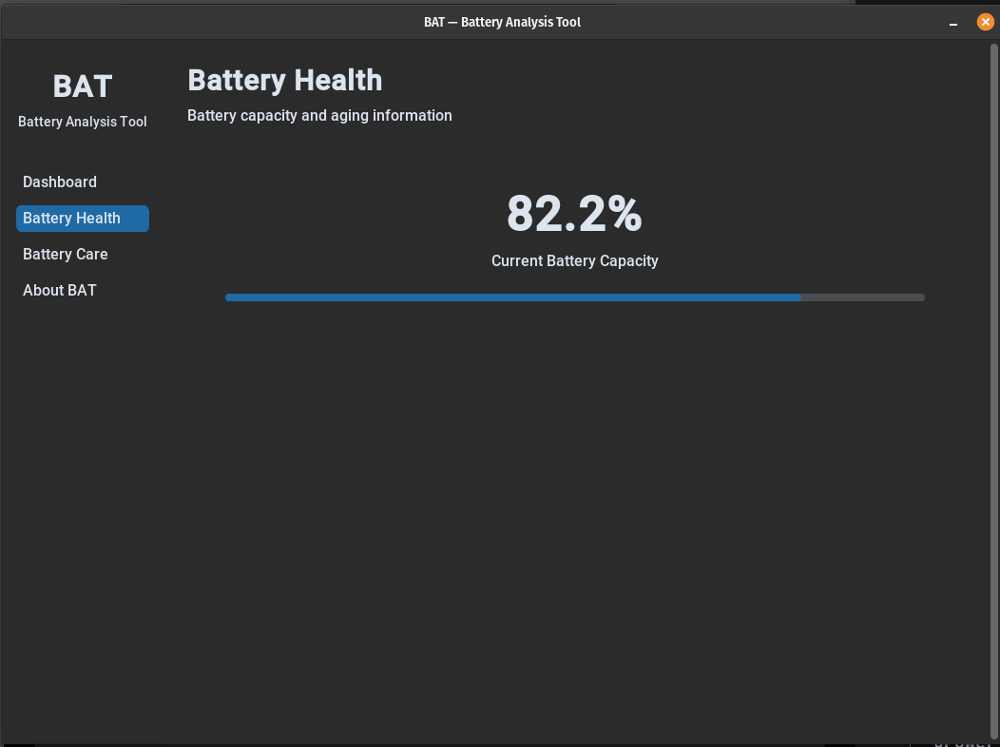
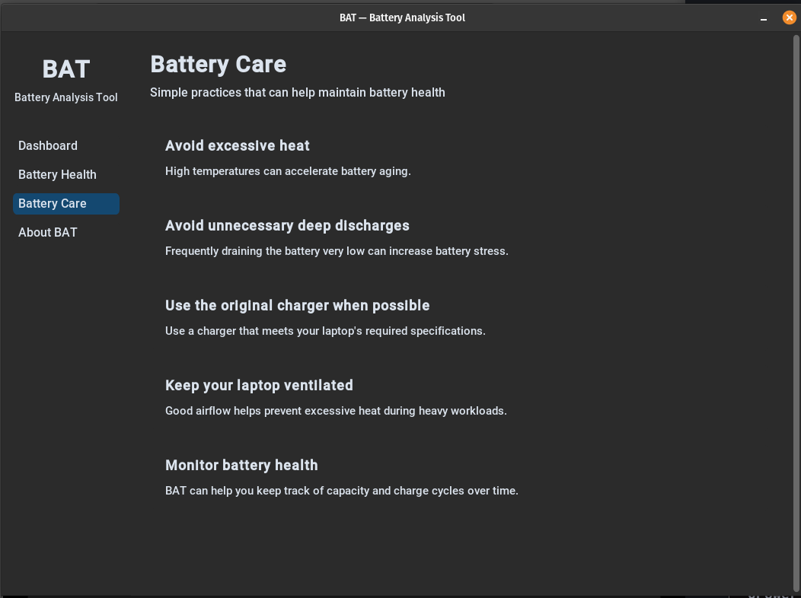

# BAT — Battery Analysis Tool

BAT is a simple Linux desktop application for monitoring and understanding laptop battery information.

## Features

- Battery percentage and charging status
- Battery health and capacity
- Charge cycle count
- Voltage, power, and energy information
- Automatic battery data refresh
- Battery care recommendations
- Simple and responsive graphical interface
- Linux UPower integration

## Screenshots

### Dashboard

### Battery Health

### Battery Care

## Requirements

- Linux
- Python 3.10+
- UPower
- CustomTkinter
- Pillow

## Installation

Clone the repository:

    git clone https://github.com/apple-pie-h/BAT.git
    cd BAT

Create and activate a virtual environment:

    python3 -m venv .venv
    source .venv/bin/activate

Install the dependencies:

    pip install -r requirements.txt

If UPower is not installed:

    sudo apt install upower

Run BAT:

    python bat.py

## How It Works

BAT uses UPower to retrieve battery information from the Linux system and displays it through a CustomTkinter graphical interface.

    Linux Battery
          |
        UPower
          |
      BAT Backend
          |
      CustomTkinter

## Project Structure

    BAT/
    ├── assets/
    │   │── bat.png
    │   │── care.png
    │   │── dashboard.png
    │   └── health.png
    ├── bat.py
    ├── battery.py
    ├── gui.py
    ├── requirements.txt
    ├── README.md
    ├── LICENSE
    └── .gitignore

## License

MIT License

Copyright (c) 2026 apple-pie-h

See the LICENSE file for details.

## Author

apple-pie-h

https://github.com/apple-pie-h/BAT
